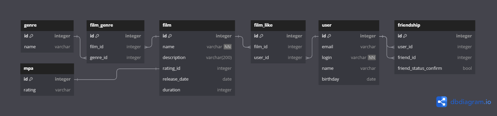

# Filmorate - кинопоиск для своих

Социальная сеть, которая поможет выбрать кино на основе того, какие фильмы вы и ваши друзья смотрите и какие оценки им
ставите.

## Технологии, применяемые в проекте

- Spring boot
- Maven
- PostgreSQL

## Диаграмма базы данных

### ER model



<details> <summary>Описание базы данных в текстовом виде</summary>  

**film**

Содержит информацию о фильмах.

Таблица состоит из полей:

- primary key `id` — идентификатор фильма;
- `name` — название фильма (не может быть пустым);
- `description` — описание фильма;
- foreign key `rating_id` (отсылает к таблице `mpa`) — идентификатор жанра:
- `release_date` — год выхода;
- `duration` — продолжительность фильма в минутах;

**mpa**

Содержит информацию о рейтингах ассоциации кинокомпаний (англ._ Motion Picture Association,_ сокращённо _МРА_).

Таблица состоит из полей:

- primary key `id` — идентификатор рейтинга;
- `rating` — возрастной рейтинг, например:
    - `PG` — детям рекомендуется смотреть такой фильм с родителями;
    - `PG-13` — детям до 13 лет смотреть такой фильм нежелательно.

**film_genre**

Связывает фильмы с жанрами.

Таблица состоит из полей:

- primary key `id` — уникальный идентификатор;
- foreign key `film_id` (отсылает к таблице `film`) — идентификатор фильма;
- foreign key `genre_id` (отсылает к таблице `genre`) — идентификатор жанра.

**genre**

Содержит информацию о жанрах кино.

Таблица состоит из полей:

- primary key `id` — идентификатор жанра;
- `name` — название жанра, например:
    - `Comedy` — комедия;
    - `Drama` — драма.

**film_like**

Связывает фильмы с пользователями, которые их оценили.

Таблица состоит из полей:

- primary key `id` — уникальный идентификатор;
- foreign key `film_id` (отсылает к таблице `film`) — идентификатор фильма;
- foreign key `user_id` (отсылает к таблице `user`) — идентификатор пользователя;

**user**

Содержит информацию о пользователях.

Таблица состоит из полей:

- primary key `id` — идентификатор пользователя;
- `email` — электронная почта пользователя;
- `login` — логин пользователя (не может быть пустым);
- `birthday` — дата рождения пользователя;

**friendship**

Связывает пользователей, которые являются друзьями, и указывает, подтверждена ли эта дружба.

Таблица состоит из полей:

- primary key `id` — уникальный идентификатор;
- foreign key `user_id` (отсылает к таблице `user`) — идентификатор пользователя;
- foreign key `friend_id` (отсылает к таблице `user`) — идентификатор друга пользователя;
- `friend_status_confirm` — статус подтверждения дружбы, например:
    - `true` — `friend_id` подтвердил дружбу с пользователем `user_id`;
    - `false` — `friend_id` не подтвердил дружбу с пользователем `user_id`;

</details>  

### Примеры запросов

<details> <summary>Получение списка всех фильмов</summary>  

```sql  
SELECT *  
FROM film  
```  

</details>  

<details> <summary>Получение списка всех пользователей</summary>  

```sql  
SELECT *  
FROM user  
```  

</details>  

<details> <summary>Получение списка `N` наиболее популярных фильмов</summary>  

```sql  
SELECT f.name, COUNT(fl.user_id) AS total_likes  
FROM film AS f 
JOIN film_like AS fl ON f.id = fl.film_id   
GROUP BY f.name  
ORDER BY total_likes DESC
LIMIT N -- подставить количество фильмов для вывода  
```  

</details>  

<details> <summary>Получение списка общих друзей с другим пользователем</summary>  

```sql  
SELECT user.name  
FROM user  
JOIN friendship ON user.id = friendship.user_id  
JOIN user AS friend ON friendship.friend_id = friend.id  
WHERE friend_status_confirm IS NOT FALSE  
```  

</details>